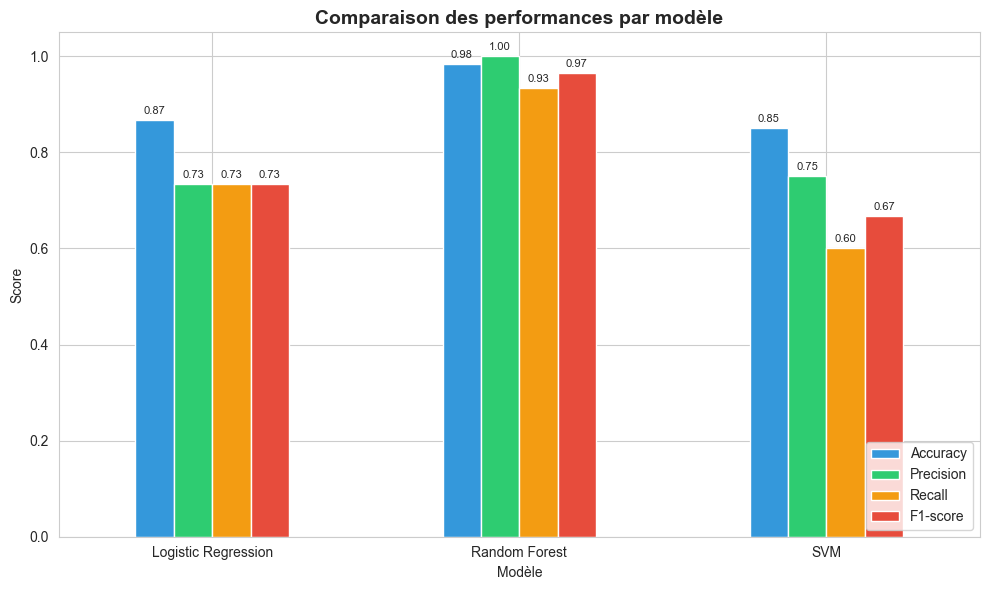
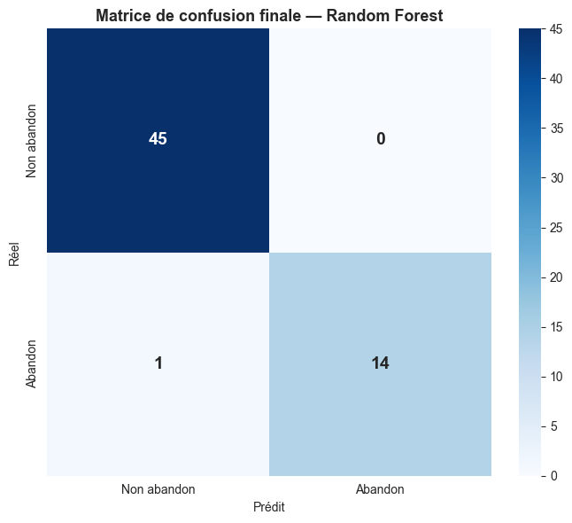

# Student dropout prediction

Academic project for the "AI Technologies" course of my Master's in Artificial Intelligence.

The goal is to predict whether a student is at risk of dropping out, from a few simple indicators: age, gender, average grade, absenteeism rate, internet access, weekly study time and extracurricular activities. The model is served through a Flask API and a small Streamlit app.

## What I did

1. Explored the data (300 students, 7 features, binary target `dropout_risk`).
2. Added two features: a presence/absence ratio and a global score combining grades, attendance and study time.
3. Compared three models with 5-fold cross-validation: Logistic Regression, Random Forest and SVM.
4. Tuned each one with GridSearch, then kept the best on F1-score, since the "dropout" class is the minority one.
5. Saved the final model and built an API and a demo app on top of it.

## Results

Random Forest came out clearly ahead. On the test set (60 students):

| Model | CV F1 | Test F1 | Accuracy | Recall (dropout) |
| --- | --- | --- | --- | --- |
| Logistic Regression | 0.74 | 0.73 | 0.87 | 0.73 |
| SVM | 0.73 | 0.67 | 0.85 | 0.60 |
| **Random Forest** | **0.93** | **0.97** | **0.98** | **0.93** |

The final model misses 1 student at risk out of 15, and raises no false alarm.





A word of caution: the dataset is small, so these scores are optimistic. With a test set of 60 students, one more mistake changes the F1 by several points. A real deployment would need much more data.

## Project structure

```
app/            Flask API and Streamlit app
data/raw/       dataset
models/         trained model (best_model.pkl)
notebooks/      full analysis, from exploration to model selection
reports/        report and figures
```

## Run it

```bash
python -m venv venv
source venv/Scripts/activate   # on Linux/Mac: source venv/bin/activate
pip install -r requirements.txt
```

Streamlit demo:

```bash
streamlit run app/streamlit_app.py
```

Flask API (port 5000):

```bash
python app/flask_api.py
```

Example request:

```bash
curl -X POST http://localhost:5000/predict \
  -H "Content-Type: application/json" \
  -d '{"age": 19, "gender": "Male", "average_grade": 9.5, "absenteeism_rate": 0.4, "internet_access": "No", "study_time_hours": 1.0, "extra_activities": "No"}'
```

The API returns the prediction, the probability of dropout and a risk level (`FAIBLE`, `MODÉRÉ` or `ÉLEVÉ`: the app's labels are in French). Other endpoints: `/health` and `/model-info`.

## Tools

Python, pandas, scikit-learn, matplotlib, seaborn, Flask, Streamlit, joblib.